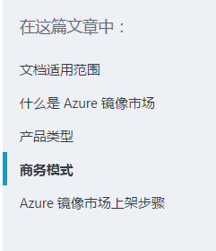
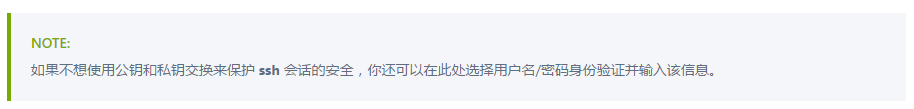
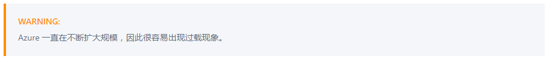
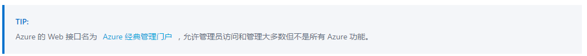
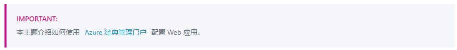

# 镜像市场文档编写指南

## markdown

文档使用 markdown 语法，支持 `h1` - `h5` 标题、语法高亮、列表等。关于 markdown 语法，请参考链接：

- [Github: Basic writing and formatting syntax（英文）](https://help.github.com/articles/basic-writing-and-formatting-syntax/)
- [markdown tutorial （英文）](http://www.markdowntutorial.com/)
- [markdown——入门指南](http://www.jianshu.com/p/1e402922ee32/)
- [markdown简明语法教程](https://github.com/Melo618/Simple-markdown-Guide)

## 缩进与代码块

本系统不支持 github 式的 `three-tick` 代码块。请使用缩进代码块。

在代码块之前空一行，并使代码块相对于前面的代码有 2 个 tab 或 8 个空格的缩进。

		1. first
		
				this.is("a code");
		
		2. second
			- second_first
		
					a.code(in_nested_lists);
				
			- second_second
会被解析为：

1. first

		this.is("a code");

2. second
	- second_first

			a.code(in_nested_lists);
		
	- second_second

## 折行

如果想在文中折行而不想破坏 `<li>` 结构，或者不想产生新的 `
`，请在行末打 2 个空格。

## 更新时间

如果希望显示最新更新时间，请在文档开头写入一个 `<tags>` 的 XML 标签，其中添加 `ms.date` 和 `wacn.date` 的属性。我们会将其显示在标题下方。其中，

- `ms.date` 会显示为 `最后更新时间（英文版）`
- `wacn.date` 会显示为 `最后更新时间（中文版）`

如：

	<tags 
	ms.date="07/07/2016"
	wacn.date="07/08/2016"/>
	
会显示为：

## 标题与章节

文章大标题请使用 `h1` 标签，比如：

	# 文档编写指南

各章节标题请使用 `h2` 标签，我们会抓取之并显示一个章节列表。比如：
	
	## 文档适用范围
	## 什么是 Azure 镜像市场
	## 产品类型
	## 商务模式
	## Azure 镜像市场上架步骤

会生成：

## Azure 自定义标签

除了 markdown 本身的语法以外，我们还支持了几个新的语法。恰当使用它们可以使你的文档更加美观，并与 Azure 官方文档保持一致的风格。我们支持：

- Note 提示
- Include 引用

### Note 提示

你可以在文档中使用 Azure 风格的提示标签。请选取合适的提示类型：

- AZURE.NOTE  
用 AZURE.NOTE 来显示中性或者正面的信息，用以强调正文中的重点，或者支持文中的关键之处。  

	`> [AZURE.NOTE] 如果不想使用公钥和私钥交换来保护 **ssh** 会话的安全，你还可以在此处选择用户名/密码身份验证并输入该信息。`

- AZURE.WARNING  
用 AZURE.WARNING 来在一些可能产生问题的情况下警告用户注意。比如，一些可能损坏系统的选项。

	`> [AZURE.WARNING] Azure 一直在不断扩大规模，因此很容易出现过载现象。`

- AZURE.TIP  
用 AZURE.TIP 来帮助用户使用文中的技术来满足需求。 Tip 也可以指出一些正文以外的替代方案。但是，即使不看 tip 也不应当影响对正文的理解。

	`> [AZURE.TIP] Azure 的 Web 接口名为 [经典管理门户](http://manage.windowsazure.cn/) ，允许管理员访问和管理大多数但不是所有 Azure 功能。`

- AZURE.IMPORTANT  
用 AZURE.IMPORTANT 来展示完成一项工作的关键步骤。

	`> [AZURE.IMPORTANT] 本主题介绍如何使用 [Azure 经典管理门户](https://manage.windowsazure.cn/) 配置 Web 应用。`

以上四种提示标签中支持代码块、图片、列表和链接，但是请保持提示简洁明了。如果你觉得需要创建一个带有许多复杂格式的提示，或许你应该将这些内容放入正文中。另外，太多的标签会打乱读者注意力，影响阅读。

#### markdown 代码样例

单行：
	
	> [AZURE.NOTE] 如果不想使用公钥和私钥交换来保护 **ssh** 会话的安全，你还可以在此处选择用户名/密码身份验证并输入该信息。

多行：

	> [AZURE.TIP] 完成本文需要一个 Azure 订阅。
	>
	> 如果没有 Azure 订阅，只需要花费几分钟就能创建一个试用帐户。

### Include 引用

如果你有些文本片段需要在多篇文档中引用，可以把它们存放在单独的 `.md` 文件中，并在需要使用的文档中写入一个链接。被引用的 include 片段可以是任何 markdown 支持的形式，包括文字、链接、图片等。请把 include 片段放在 [/includes](https://github.com/msopentechcn/marketplace-content/tree/master/includes) 文件夹中。文章发布后，被引用的片段会无缝地集成进文档的指定位置。

#### 注意事项

- 当在不同文档中使用同样的文本片段时，可以使用 include.
- 请保证 include 片段包含的是完整的句子，不依赖于上下文。
- 请不要在 include 片段中再引用 include 片段。

#### markdown 代码样例

	[AZURE.INCLUDE [include-short-name](../includes/include-file-name.md)]

## 文档文件命名与地址规范

**请使用无空格的小写英文字母、中文字符或连字符(`-`)做文档文件、文件夹和图片的路径名。**

文档编写好之后，请提交 pull request 到指定的 github 库中，我们会自动拉取其内容并转换为 HTML格式显示在我们的页面上。网页的相对路径与文件在 git 上的相对路径一致。比如：

	https://github.com/msopentechcn/marketplace-content/blob/master/publishguide.md

对应的网页是

	http://.../documentation/article/publishguide/

网页中使用的图片请一并上传到 git 上，并在 md 文件中使用相对路径引用。比如
	
	

我们会自动将其拷贝到服务器上并处理其地址。

如果引用了镜像商店中的路径，请使用 `~/` 作为相对路径的头部代替 `http://.../market/`. 比如，想引用

	http://.../market/Vhd/Show?vhdId=164945&version=23555

请写链接为

	[my_vhd](~/Vhd/Show?vhdId=164945&version=23555)

我们会将其处理为可以访问的地址。
