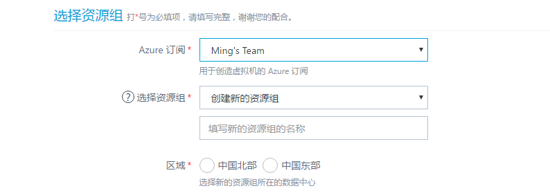
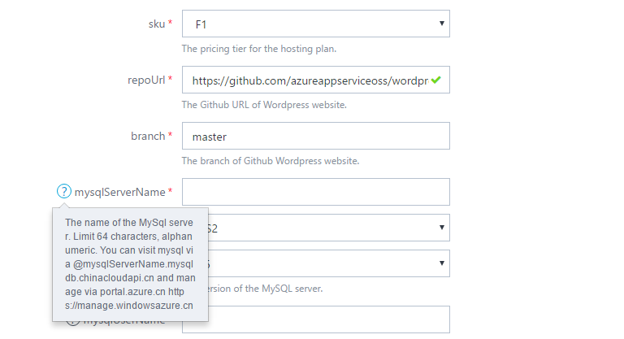

# 在 Azure 镜像市场上部署Azure资源管理模板

Azure上部署Azure资源管理模板过程比较简单，您只要遵循以下步骤，就能轻松地将您的Azure资源管理模板部署到 Azure。

## 先决条件和准备

1. 您需要一个有 Azure 账户。（如果还没有，[请到这里购买](https://www.azure.cn/pricing/pia/)）
2. 如果您需要申请试用账号，[请访问这里](https://www.azure.cn/pricing/1rmb-trial?v=b)。
3. 准备发布前资料。参考 [发布商入驻指南](https://mmp-staging.chinacloudsites.cn/market/Documentation/article/publishguide/) 。

## 部署Azure资源管理模板

> [AZURE.NOTE] 注意:Azure资源管理模板部署时候需要登录您的Azure 账户，部署成功后相应的资源会在您的Azure 账号里面部署成功。
> 区分镜像是Azure虚拟机还是Azure资源管理模板，请看镜像的简要说明和详细说明部分。

### Azure资源管理模板部署清单

Azure 镜像市场主页搜索相应的镜像，然后在列表页或者镜像详细页点击 “立即部署”，其中公共必填信息如下图：

每个镜像的Azure资源管理模板是不同的，这里给出一个参考，请按照各个模板的详细要求填写所需要的信息，如下图：

其中，带“*”的为必填项目，“？”为帮助信息，该字段只能填写64个英文字符/中文字。

### Azure资源管理模板内容规范

规范的格式一般不是必须，但是遵循规范有利于用户对您的镜像的查找、排序操作等。

| **项目名称** | **规范描述** | **例子** |
| --- | --- | --- |
| 选择资源组 | 创建新的资源组或者选择已经存在的资源组 |  |
| 区域 | 选择部署的区域，可以选择中国北部或者中国东部 |  |
