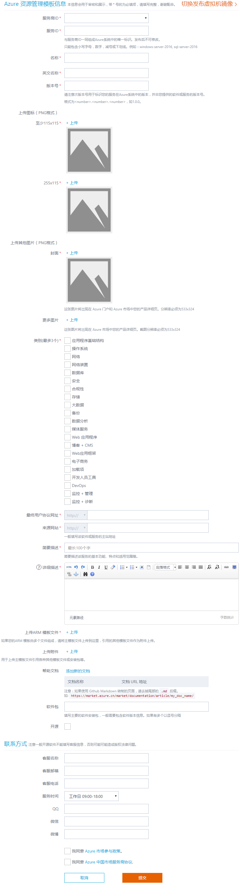

# Azure 市场ARM模板发布指南

Azure 市场上发布ARM模板，您只要遵循以下步骤，就能轻松地将您的ARM模板发布到 Azure 市场。

## 先决条件和准备

1. 首先，注册成为 Azure 市场服务商。 请参考 [服务商入驻指南](https://market-publish.azure.cn/Documentation/publishguide/) 。
2. 其次，准备发布前资料和ARM模板文件，参考 [ARM模板创作指南](https://docs.azure.cn/zh-cn/azure-resource-manager/resource-group-authoring-templates)。
3. 再次，ARM模板制作完成后需要进行本地测试，注意测试可以利用Powershell或Azure-cli等工具，参考 [ARM模板测试部署指南](https://docs.azure.cn/zh-cn/azure-resource-manager/resource-manager-create-first-template)。

## 发布ARM模板

进入发布页面 [Azure ARM模板发布主页](https://market-publish.azure.cn/Vhd/Arm)，发布ARM模板，分三步完成：

1. ARM模板发布申请。服务商在 Azure 市场发布页点击“发布”，填写发布申请表单，完善ARM模板相关的资料内容，然后申请上架。
2. ARM模板审核和测试。 Azure 市场团队会对申请上架的ARM模板进行审核，审核通过后， Azure 团队会通过邮件通知服务商进行ARM模板的再次测试和验证，服务商需将测试结果告知 Azure 市场团队。
3. ARM模板正式发布。服务商测试通过后，Azure 市场团队进行最后确认，并正式上架。上架发布完成后，系统会通过邮件方式通知服务商上架结果。一般而言，从ARM模板审核通过最终测试到展示在 Azure 门户及 Azure 市场大概需要3-5个工作日。

> [AZURE.NOTE] 注意: ARM模板引用镜像需注意，如镜像不在 Azure 市场，一定要在发布ARM之前先发布被引用的镜像。

### ARM模板内容发布表单

Azure 市场发布主页点击 “发布”——>“Azure资源管理模板”，如下图：

其中，带“*”的为必填项目，“？”为帮助信息。

### ARM模板表单内容规范
由于ARM模板需要发布到 Azure 门户和 Azure 市场当中，因此遵循规范有利于用户对您的ARM模板的查找、排序操作等。

| **项目名称** | **规范描述** | **例子** |
| --- | --- | --- |
| 服务商ID |此处不用手动填写，系统会自动加载入驻信息，选择即可||
| 服务ID |此服务ID与服务商ID在 Azure 系统中组合成一个唯一标识。只能包含小写字母、数字、减号或下划线组成，发布后不可修改。|windows-server-2016,sql-server-2016|
| 名称 | 推荐格式：软件名称-版本号-其余信息。 |ImageName-7.2-SC-UTF8 (Openlogic CentOS 7.2)|
| 英文名称 | ARM模板英文名称 ||
| 版本号 | ARM模板当前版本号，注意不是软件自身版本号 ||
| 上传图标 | 此处上传图片用于Logo展示，像素必须按要求上传（115x115,255x115）||
| 上传其他图片 | 封面：用于 Azure 门户及 Azure 市场中产品详细页，一般为产品架构图。  更多图片：用于 Azure 市场中产品详细页面。 两处图片像素必须按要求上传 图片大小：像素必须为：533x324 ||
| 类别 | 选择与ARM模板类型对应的类别，最多支持3个||
| 用户协议网址 | 地址一般为用户和ISV之间的使用协议、license等使用事项及收费情况的地址 ||
| 来源网站 | 一般填写该ARM模板中的主要软件所在的主站地址 ||
| 简要描述 | 简要描述该服务的基本功能、特点和适用范围，最多不超过50汉字或100个英文字母。 ||
| 详细描述 | 一般包含该ARM模板的产品详情、使用说明和技术详情等，支持富文本编辑，可以采用多种文字格式。请在技术详情中对端口功能进行说明 ||
| 上传ARM模板文件 |注意这里只允许上传主模板文件，其他模板或文件作为附件上传||
| 上传附件 |用于上传主模板文件引用各种其他模板文件或安装包等||
| 帮助文档 | 用户帮助文档的url地址。||
| 软件包 | 主要的软件安装包，一般需要包含软件版本信息，以逗号分隔。 | tomat-5.5.3,php-5.3.1 |
| 开源 | 如果开源则勾选 ||
| 联系方式 | 请留下技术支持及客服的联系方式 ||

