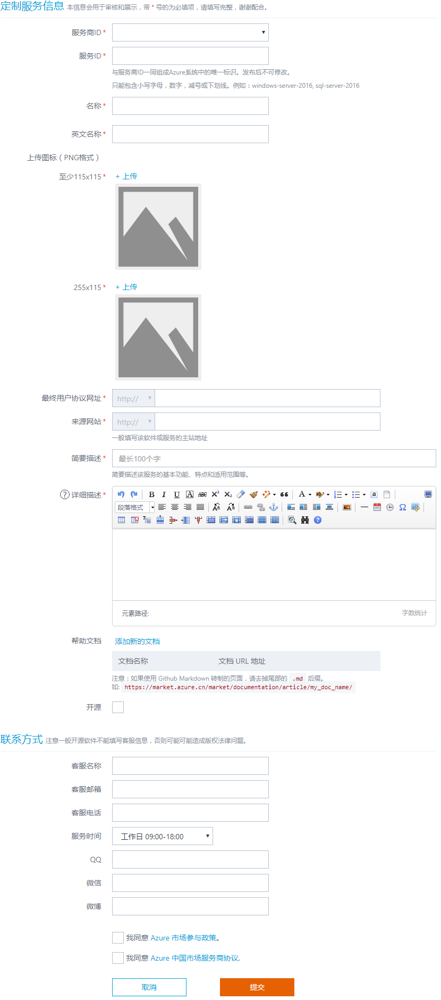

# Azure 市场定制服务发布指南

Azure 市场上发布定制服务，您只要遵循以下步骤，就能轻松地将您的定制服务发布到 Azure 市场。

## 先决条件和准备

1. 首先，注册成为 Azure 市场服务商。 请参考 [服务商入驻指南](https://market-publish.azure.cn/Documentation/publishguide/) 。
2. 其次，准备定制服务发布前资料。

## 发布定制服务

进入发布页面 [Azure 定制服务发布主页](https://market-publish.azure.cn/Vhd/Trial)，发布定制服务，分两步完成：

1. 定制服务发布申请。服务商在 Azure 市场发布页点击“发布”->“定制服务”，填写发布申请表单，完善定制服务相关的资料内容，然后申请上架。
2. 定制服务审核和发布。 收到请求后，Azure 市场团队会对申请上架的定制服务进行审核。审核通过后，正式上架，并通过邮件方式通知服务商上架结果。

### 定制服务内容发布表单

Azure 市场发布主页点击 “发布”——>“定制服务”，如下图：

其中，带“*”的为必填项目，“？”为帮助信息。

###定制服务表单内容规范
由于定制服务需要发布到 Azure 门户和 Azure 市场当中，因此遵循规范有利于用户对您的定制服务的查找、排序操作等。

| **项目名称** | **规范描述** | **例子** |
| --- | --- | --- |
| 服务商ID |此处不用手动填写，系统会自动加载入驻信息，选择即可||
| 服务ID |此服务ID与服务商ID在 Azure 系统中组合成一个唯一标识。只能包含小写字母、数字、减号或下划线组成，发布后不可修改。|windows-server-2016,sql-server-2016|
| 名称 | 推荐格式：软件名称-版本号-其余信息。 |ImageName-7.2-SC-UTF8 (Openlogic CentOS 7.2)|
| 英文名称 | 定制服务的英文名称 ||
| 上传图标 | 此处上传图片用于Logo展示，像素必须按要求上传（115x115,255x115）||
| 用户协议网址 | 地址一般为用户和ISV之间的使用协议、license等使用事项及收费情况的地址 ||
| 来源网站 | 一般填写该定制服务的主站地址 ||
| 简要描述 | 简要描述该服务的基本功能、特点和适用范围，最多不超过50汉字或100个英文字母。 ||
| 详细描述 | 一般为该定制服务产品详情、使用说明和技术详情等，支持富文本编辑、同时可上传多张产品图片，可以采用多种文字格式。请在技术详情中对端口功能进行说明 ||
| 帮助文档 | 用户帮助文档的url地址。||
| 软件包 | 主要的软件安装包，一般需要包含软件版本信息，以逗号分隔。 | tomat-5.5.3,php-5.3.1 |
| 开源 | 如果开源则勾选 ||
| 联系方式 | 请留下技术支持及客服的联系方式 ||

