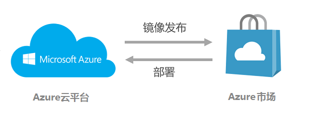
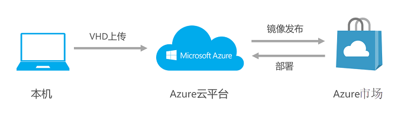

# Azure 市场虚拟机镜像制作指南

本指南为 Azure 市场独立软件供应商介绍制作虚拟机镜像并上传到 Azure 的主要过程。

制作虚拟机镜像有两种方式。一种是直接在 Azure 上申请相应的操作系统虚拟机，安装应用软件并构建镜像；第二种是从用户本机通过Hyper-v创建操作系统，安装应用软件后制作VHD镜像文件，然后上传VHD文件至 Azure 上构建镜像。第一种方式的操作系统属于 Azure 定制方式，操作比较简单，适合普通的中小型镜像制作；第二种方式的操作系统属于用户自定义方式，操作相对复杂，适合中大型应用或有特殊定制需要的镜像制作。

## 从 Azure 上构建Linux应用程序镜像

下图描述总体的虚拟机的VHD镜像生成以及发布到 Azure 市场的过程：

具体步骤如下：

1. 从 Azure 管理平台上Linux申请虚拟机， 安装和配置您要发布的应用软件产品，制作成镜像并保存。
2. 申请预发布环境，将第一步中的虚拟机镜像部署到测试发布环境进行验证。
3. 发布镜像，登录到 Azure 市场，根据发布流程将已经测试完毕的虚拟机镜像发布到 Azure 市场。

### 第一步：登录中国版 Azure 管理平台，申请建立Linux虚拟机

1. 从库中选择相应的操作系统建立虚拟机。比如选择A1配置，注意这个配置是发布时候的配置，镜像发布后进行部署的时候，这个配置是可以修改的。
2. 虚拟机建立后启动，可以通过ssh登录，登录账号拥有sudo权限。

### 第二步：安装Application并制作虚拟机镜像

> [AZURE.NOTE] 本节我们以CentOS6.x为例进行介绍，基于 Azure 和Linux的虚拟机镜像制作。基于 Azure 和Windows的虚拟机镜像制作，可参考文档 [捕获使用经典部署模型创建的 Azure Windows 虚拟机的镜像](https://www.azure.cn/documentation/articles/virtual-machines-windows-classic-capture-image/)。

1. 安装Application软件。登录虚拟机，安装应用软件，并设置开启启动服务。
2. 尝试清除虚拟机系统并使其适用于重新配置。  
键入如下命令，对于过程中 “Do you want to proceed?”，选择'y'。

        sudo waagent -deprovision

3. 虚拟机关机。  
    键入Exit退出虚拟机，在 Azure 管理平台上，选择对应的虚拟机然后关机。
4. 捕获虚拟机。  
    对相应的虚拟机，点击“捕获”，输入新镜像的名字，并选择选项“I have run the de-provision command on the Virtual Machine”，生成新镜像。
> [AZURE.NOTE] 注意:虚拟机镜像的存储位置对应的容器属性应该设置为“公共Blob”，否则在 Azure 市场上发布的时候会找不到对应的镜像。

此时创建新的虚拟机的时候，便可以“从库中”选择你最新创建的虚拟机镜像。

## 从 Azure 上构建Windows应用程序镜像

从 Azure 上构建windows应用程序镜像同构建Linux应用程序镜像总体流程比较类似，可以参考上图Linux镜像的制作发布等流程，具体细节又有所差别。

具体步骤如下：

1. 从 Azure 管理平台上申请Windows虚拟机， 安装和配置您要发布的应用软件产品，制作成镜像并保存。
2. 申请预发布环境，将第一步中的虚拟机镜像部署到测试发布环境进行验证。
3. 发布镜像，登录到 Azure 市场，根据发布流程将已经测试完毕的虚拟机镜像发布到 Azure 市场。
 
### 第一步：登录中国版 Azure 管理平台，申请建立Windows虚拟机

1. 从库中选择相应的操作系统建立虚拟机。比如选择A1配置，注意这个配置是发布时候的配置，镜像发布后进行部署的时候，这个配置是可以修改的。
2. 虚拟机建立后启动，可以通过远程桌面连接登录到Windows虚拟机，注意远程登录的时候可以在“显示选项”中的“本地资源-详细信息”中共享本地磁盘或目录到Windows虚拟机。

### 第二步：安装Application并制作虚拟机镜像

> [AZURE.NOTE] 本节我们以Windows Server 2012为例进行介绍，基于 Azure 和Windows的虚拟机镜像制作。基于 Azure 和Windows的虚拟机镜像制作，可参考文档 [捕获使用经典部署模型创建的 Azure Windows 虚拟机的映像](https://www.azure.cn/documentation/articles/virtual-machines-windows-classic-capture-image/)。

1. 安装Application软件。登录虚拟机，安装应用软件，并设置开启启动服务。
2. 尝试清除虚拟机系统并使其适用于重新配置，并关机。  
打开终端窗口，进入目录 `%windir%\system32\sysprep`，比如`C:\Windows\System32\sysprep`。然后运行: 

        sysprep.exe

	此时会显示“系统准备工具”对话框。在“系统清理操作”中，选择“进入系统全新体验(OOBE)”，并确保选中“通用”。在“关机选项”中选择“关机”。单击“确定”关机。

3. 捕获虚拟机。  
对相应的虚拟机，点击“捕获”，输入新镜像的名字，并选择选项“我已经在虚拟机上运行了Sysprep”，生成新镜像。

	> [AZURE.NOTE] 注意:虚拟机镜像的存储位置对应的容器属性应该设置为“公共Blob”，否则在 Azure 市场上发布的时候会找不到对应的镜像。

此时创建新的虚拟机的时候，便可以“从库中”选择你最新创建的虚拟机镜像。

## 从本机构建Linux应用程序VHD镜像

下图描述了总体的虚拟机镜像的VHD生成，上传以及发布到 Azure 市场的全过程：

具体步骤如下：

1. 在本地计算机（Windows平台）上安装Hyper-V，并安装您所需要的虚拟机操作系统
2. 在此操作系统上安装和配置您要发布的应用软件产品
3. 在本地计算机上制作VHD为镜像
4. 将制作好的VHD通过PowerShell上传到 Azure 存储账号上，并获取VHD镜像在 Azure 上的存储位置（url地址）
5. 申请预发布环境，将第四步中 Azure 上的VHD镜像部署到测试发布环境进行验证
6. 正式发布，登录到 Azure 市场，并根据发布流程将已经测试完毕的VHD发布到 Azure 市场

### 第一步：准备

1. 检查操作系统版本兼容性  
如操作系统为Linux，请确认所安装的Linux系统版本是 Azure 所支持的，具体请参考：Azure 支持的Linux版本
2. 本机安装Hyper-V  
确认Hyper-V在您的Windows系统中安装并可以使用。  
关于Hyper-V在各版本Windows上的安装和配置，请参考： [安装Hyper-V并创建虚拟机](https://azure.microsoft.com/en-us/documentation/articles/virtual-machines-linux-endorsed-distros/)
3. 本机安装了PowerShell命令行工具  
    获取 Azure 的配置文件（过程中需要输入 Azure 的账号密码），并保存到磁盘。  

        Get-AzurePublishSettingsFile –Environment azurechinacloud  

    导入账户认证信息，路径用引号（为上一步骤中的配置文件路径）。

        Import-AzurePublishSettingsFile <PathToFile>

第一步完成后，即可开始制作镜像，制作VHD主要包括两种方式，第一种是通过本地Hyper-V虚拟机建立VHD，第二种是直接在 Azure 制作VHD。以下以本地建立VHD为例进行介绍：

### 第二步：从本机制作Linux应用程序VHD镜像

本节我们以CentOS6.x为例进行介绍，其他Linux操作系统的VHD制作可参考官方文档：[制作和上载Linux虚拟机VHD](https://azure.microsoft.com/en-us/documentation/articles/virtual-machines-linux-classic-create-upload-vhd/)。

> [AZURE.TIP] Hyper-V支持的操作系统英文文档：[Hyper-V支持的CentOS和RedHat版本](https://technet.microsoft.com/en-us/library/dn531026(v=ws.12).aspx)  
> CentOS6.x 的VHD磁盘制作英文官方文档：[基于CentOS的VHD虚拟机制作过程](https://azure.microsoft.com/en-us/documentation/articles/virtual-machines-linux-create-upload-centos/#centos6)。

1. 安装CentOS 6.5 Linux虚拟机和应用软件  
您需要通过 Hyper-V 安装 Linux 虚拟机。注意在安装过程中，一定要选择后续应用软件所需要的各个组件，比如 C/C++ 编译器或 cmake 或 KDE 图形界面等，虚拟机安装完成后需要进行系统设置使得 Linux 可以连接外网。  
Linux虚拟机安装完毕后，继续安装和配置应用软件。
2. 网络和网卡配置
    1. 卸载NetworkManager（这个软件包一般Linux没有装）

            # sudo rpm -e --nodeps NetworkManager

    2. 编辑文件`/etc/sysconfig/network`如下:

            NETWORKING=yes
            OSTNAME=localhost.localdomain

    3. 编辑网卡配置文件`/etc/sysconfig/network-scripts/ifcfg-eth0`:

	        DEVICE=eth0
	        ONBOOT=yes
	        BOOTPROTO=dhcp
	        TYPE=Ethernet
	        USERCTL=no
	        PEERDNS=yes
	        IPV6INIT=no

    4. 修改udev防止以太网接口生成固定规则，在 Azure 平台上克隆虚拟机的时候，这些规则可能导致问题。

	        # sudo ln -s /dev/null /etc/udev/rules.d/75-persistent-net-generator.rules
	        # sudo rm -f /etc/udev/rules.d/70-persistent-net.rules

    5. 确保系统在启动的时候网络服务正常:

			# sudo chkconfig network on

3. 对于CentOS 6.3或早期版本，安装驱动Linux Integration Services (LIS)，在CentOS 6.4+ 以上版本跳过此步骤  
    下载如下软件包，并通过rpm进行安装：[LIS download page](https://www.microsoft.com/en-us/download/details.aspx?id=46842)
4. 安装软件包python-pyasn1，后面的WALinuxAgent依赖于此

		# sudo yum install python-pyasn1

5. 修改yum相关配置，为安装WaLinuxAgent做准备
    1. 编辑yum配置文件`/etc/yum.repos.d/CentOS-Base.repo`

	        [openlogic]
	        name=CentOS-$releasever - openlogic packages for $basearch
	        baseurl=http://olcentgbl.trafficmanager.net/openlogic/$releasever/openlogic/$basearch/
	        enabled=1
	        gpgcheck=0
	        [base]
	        name=CentOS-$releasever - Base
	        baseurl=http://olcentgbl.trafficmanager.net/centos/$releasever/os/$basearch/
	        gpgcheck=1
	        gpgkey=file:///etc/pki/rpm-gpg/RPM-GPG-KEY-CentOS-6
	        #released updates
	        [updates]
	        name=CentOS-$releasever - Updates
	        baseurl=http://olcentgbl.trafficmanager.net/centos/$releasever/updates/$basearch/
	        gpgcheck=1
	        gpgkey=file:///etc/pki/rpm-gpg/RPM-GPG-KEY-CentOS-6
	        #additional packages that may be useful
	        [extras]
	        name=CentOS-$releasever - Extras
	        baseurl=http://olcentgbl.trafficmanager.net/centos/$releasever/extras/$basearch/
	        gpgcheck=1
	        gpgkey=file:///etc/pki/rpm-gpg/RPM-GPG-KEY-CentOS-6
	        #additional packages that extend functionality of existing packages
	        [centosplus]
	        name=CentOS-$releasever - Plus
	        baseurl=http://olcentgbl.trafficmanager.net/centos/$releasever/centosplus/$basearch/
	        gpgcheck=1
	        enabled=0
	        gpgkey=file:///etc/pki/rpm-gpg/RPM-GPG-KEY-CentOS-6
	        #contrib - packages by Centos Users
	        [contrib]
	        name=CentOS-$releasever - Contrib
	        baseurl=http://olcentgbl.trafficmanager.net/centos/$releasever/contrib/$basearch/
	        gpgcheck=1
	        enabled=0
	        gpgkey=file:///etc/pki/rpm-gpg/RPM-GPG-KEY-CentOS-6

    2. 配置`/etc/yum.conf`

       		http_caching=packages

        另外，CentOS 6.3需要增加如下行：  

        	exclude=kernel*

    3. 编辑`/etc/yum/pluginconf.d/fastestmirror.conf`, 使得yum模块`fastestmirror`无效  
        在[main]一节, 设置

        	set enabled=0

    4. 清空现有的yum源数据  

       		# yum clean all

    5. 对于CentOS 6.3, 更新内核:  

        	# sudo yum --disableexcludes=all install kernel

    6. 在grub配置中为 Azure 修改内核启动参数，打开`/boot/grub/menu.lst`，增加：

       		console=ttyS0 earlyprintk=ttyS0 rootdelay=300 numa=off

        建议去掉以下参数：

        	rhgb quiet crashkernel=auto

6. 通过yum安装WaLinuxAgent

    1. 安装 Azure Linux Agent

        	# sudo yum install WALinuxAgent

    2. 打开配置文件`/etc/waagent.conf`如下修改:

	        ResourceDisk.Format=y
	        ResourceDisk.Filesystem=ext4
	        ResourceDisk.MountPoint=/mnt/resource
	        ResourceDisk.EnableSwap=y
	        ResourceDisk.SwapSizeMB=2048`　　## NOTE：此项根据你的需要设置

    3. 运行如下命令，你将不能再启动此虚拟机，直到它部署在 Azure 上运行。

	        # sudo waagent -force -deprovision  
	        # export HISTSIZE=0  
	        # logout

7. 在 Hyper-V 中关闭 Linux，Linux VHD 文件已经制作好并可以上传到 Azure。

### 第三步：将VHD上传至 Azure

用PowerShell将VHD文件上传到 Azure.
　
假设上传的文件是`myvhd.vhd`，上传存储空间是`mystorage`，容器是`mycontainer`.

1. 在 Azure 管理平台上建立存储位置。  
假设我们的目标是将VHD文件放置到 Azure 上的存储空间`mystorage`中的容器`mycontainer`中，位置为`myurl`。  
进入 Azure 管理平台，建立存储空间 `mystorage` 并在其下面建立容器 `mycontainer` ，然后拷贝这个容器的url位置。

	> [AZURE.NOTE] 注意:容器的属性一定要设置为“公共blob”属性，只有“公共blob”属性中的VHD镜像才能够被发布到 Azure 市场。
  
2. 将本地的VHD文件上传至 Azure 的指定位置。打开PowerShell，在PowerShell中输入如下指令。

    	Add-AzureVhd [[-NumberOfUploaderThreads] [<Int32>]] -Destination <BlobStorageURL>/<YourImagesFolder>/<VHDName> -LocalFilePath <PathToVHDFile>

    例如：

    	Add-AzureVhd -NumberOfUploaderThreads 5 -Destination https://mystorage.blob.core.chinacloudapi.cn/mycontainer/myvhd.vhd -LocalFilePath D:\Mydir\Hyper-V\myvhds\myvhd.vhd

3. 点击“虚拟机”-“映像”-“创建”，然后选择刚才上传的vhd创建镜像。至此，您已经成功完成了镜像的制作和上传。下一步，便可以发布镜像到 Azure 市场。

## 从本机构建Windows应用程序虚拟机镜像

下图描述了总体的虚拟机镜像的VHD生成，上传以及发布到 Azure 市场的全过程：

具体步骤如下：

1. 在本地计算机（Windows平台）上安装Hyper-V，并安装您所需要的虚拟机操作系统
2. 在此操作系统上安装和配置您要发布的应用软件产品
3. 在本地计算机上制作VHD为镜像
4. 将制作好的VHD通过PowerShell上传到 Azure 存储账号上，生成镜像，并获取在 Azure 上的存储位置（url地址）
5. 申请预发布环境，将第四步中 Azure 上的虚拟机镜像部署到测试发布环境进行验证
6. 正式发布，登录到 Azure 市场，并根据发布流程将已经测试完毕的VHD发布到 Azure 市场

### 第一步：准备

1. 检查操作系统版本兼容性  
如操作系统为Windows，请确认所安装的Windows系统版本是 Azure 所支持的。
2. 本机安装Hyper-V  
确认Hyper-V在您的Windows系统中安装并可以使用。  
关于Hyper-V在各版本Windows上的安装和配置，请参考： [安装Hyper-V并创建虚拟机](https://technet.microsoft.com/library/hh846766.aspx)
3. 本机安装了PowerShell命令行工具  
获取 Azure 的配置文件（过程中需要输入 Azure 的账号密码），并保存到磁盘。  

		Get-AzurePublishSettingsFile –Environment azurechinacloud  

    导入账户认证信息，路径用引号（为上一步骤中的配置文件路径）。  

    	Import-AzurePublishSettingsFile <PathToFile>

第一步完成后，即可开始制作镜像，制作VHD主要包括两种方式，第一种是通过本地Hyper-V虚拟机建立VHD，第二种是直接在 Azure 制作VHD。以下以本地建立VHD为例进行介绍：

### 第二步：从本机制作Windows应用程序VHD镜像

本节我们以Windows Server12 为例进行介绍，Windows操作系统的VHD制作可参考英文官方文档： [Create and upload a Windows Server VHD to Azure](https://azure.microsoft.com/en-us/documentation/articles/virtual-machines-windows-classic-createupload-vhd/)。

1. 安装Application软件。登录虚拟机，安装应用软件，并设置开启启动服务。
2. 尝试清除虚拟机系统并使其适用于重新配置，并关机。  
打开终端窗口，进入目录， `%windir%\system32\sysprep`，比如`C:\Windows\System32\sysprep`. 然后运行:   

		sysprep.exe

    此时会显示“系统准备工具”对话框。在“系统清理操作”中，选择“进入系统全新体验(OOBE)”，并确保选中“通用”。在“关机选项”中选择“关机”。单击“确定”关机。
3. 在 Hyper-V 中关闭Linux，Linux VHD文件已经制作好并可以上传到 Azure。

### 第三步：将VHD上传至 Azure

用PowerShell将VHD文件上传到 Azure

假设上传的文件是`myvhd.vhd`，上传存储空间是`mystorage`，容器是`mycontainer`

1. 在 Azure 管理平台上建立存储位置。  
假设我们的目标是将VHD文件放置到 Azure 上的存储空间`mystorage`中的容器`mycontainer`中，位置为`myurl`。  
进入 Azure 管理平台，建立存储空间`mystorage`并在其下面建立容器`mycontainer`，然后拷贝这个容器的url位置。
	> [AZURE.NOTE] 注意:容器的属性一定要设置为“公共blob”属性，只有“公共blob”属性中的VHD镜像才能够被发布到 Azure 市场。

2. 将本地的VHD文件上传至 Azure 的指定位置。打开PowerShell，在PowerShell中输入如下指令。

    	Add-AzureVhd [[-NumberOfUploaderThreads] [<Int32>]] -Destination <BlobStorageURL>/<YourImagesFolder>/<VHDName> -LocalFilePath <PathToVHDFile>

    例如：

    	Add-AzureVhd -NumberOfUploaderThreads 5 -Destination https://mystorage.blob.core.chinacloudapi.cn/mycontainer/myvhd.vhd -LocalFilePath D:\Mydir\Hyper-V\myvhds\myvhd.vhd

3. 生成虚拟机镜像
点击“虚拟机”-“映像”-“创建”，然后选择刚才上传的VHD创建镜像。至此，您已经成功完成了镜像的制作和上传。下一步，便可以发布镜像到 Azure 市场。

## 镜像发布前的检查单

在发布镜像提交到 Azure 市场之前，请确保以下检查单全部通过：

### 产品镜像要求

产品镜像必须满足如下要求：

- 适用于生产环境，Azure 市场原则上不接受测试版本产品上架
- 镜像为自包含镜像，所依赖的软件组件，包括客户端应均包括在此镜像中
- 不包含任何已知的缺陷，恶意软件和病毒
- 镜像必须经过严格内测，确保镜像可用性
- 对于Linux镜像，默认禁止Root登录
- 对于Linux镜像，镜像中不包含任何用户认证密钥信息

### 产品描述要求

提供至少满足镜像发布表单的描述信息，具体信息见参见 [Azure 市场虚拟机镜像发布指南](~/documentation/article/imagepublishguide/)。内容主要包括但不限于：

- 产品信息（SKU，服务商名称，产品名称，短描述，完整描述）
- 产品logo：2张固定大小像素的png格式的图片（115x115, 255x115）
- 产品图片：此类图片用于产品说明中，可以是产品架构图或产品说明图片等，像素大小要求 （533x324）
- 镜像VHD文件地址：发布VHD镜像文件所在的Azure Blob的url地址
- 产品售后服务（客服联系方式，时间）