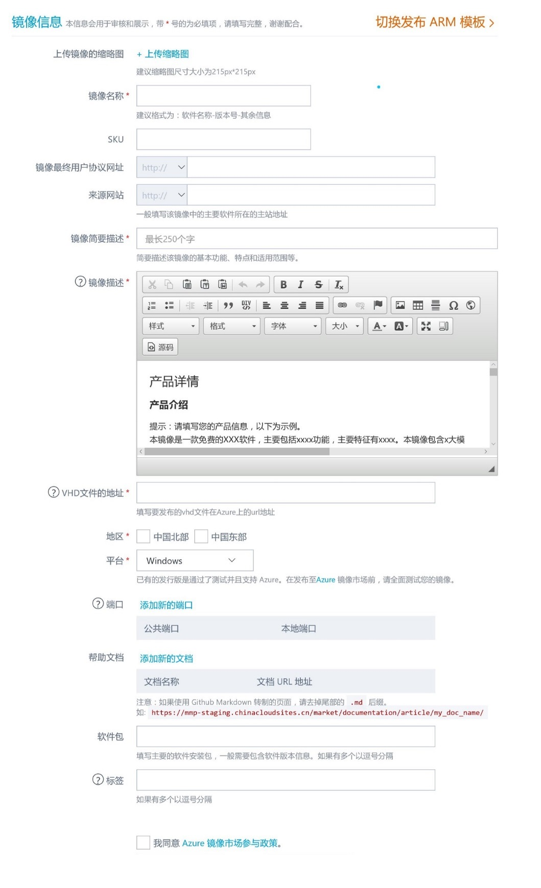

# 在 Azure 镜像市场上发布虚拟机镜像

Azure上发布虚拟机镜像过程比较简单，您只要遵循以下步骤，就能轻松地将您的镜像发布到 Azure 镜像市场。

## 先决条件和准备

1. 您需要一个有 Azure 账户。（如果还没有，[请到这里购买](https://www.azure.cn/pricing/pia/)）
2. 如果您需要申请试用账号，[请访问这里](https://www.azure.cn/pricing/1rmb-trial?v=b)。
3. 准备发布前资料。参考 [发布商入驻指南](https://mmp-staging.chinacloudsites.cn/market/Documentation/article/publishguide/) ；准备好虚拟机镜像文件，参考 [虚拟机镜像制作](https://mmp-staging.chinacloudsites.cn/market/Documentation/article/imageguide/)。

## 发布虚拟机镜像

> [AZURE.NOTE] 注意:虚拟机镜像文件所在的存储容器的属性应该设置为“公共Blob”，否则在Azure 镜像市场上发布的时候会出现找不到镜像的错误。
发布虚拟机并能够被用户部署，需要分两步：

1. 发布虚拟机镜像。将虚拟机发布到虚拟机镜像市场，发布成功后，用户还搜索不到虚拟机镜像，您需要测试镜像并完善镜像相关的资料内容后，申请镜像上架。
2. 申请镜像上架。虚拟机镜像发布并测试后，需要申请镜像上架；平台管理员收到上架请求后，会对镜像进行测试和全面检查，合格后管理员会批准上架，此时用户方可搜索并部署已经发布的镜像。

### 虚拟机内容发布清单

Azure 镜像市场主页点击 “发布”——>“虚拟机镜像”，如下图：

其中，带“*”的为必填项目，“？”为帮助信息。

### 虚拟机内容规范

规范的格式一般不是必须，但是遵循规范有利于用户对您的镜像的查找、排序操作等。

| **项目名称** | **规范描述** | **例子** |
| --- | --- | --- |
| 缩略图 | 一般要求为正方形，像素要求215* 215以上，低于此尺寸可能导致图片扭曲或显示模糊。 |  |
| 镜像名称 | 推荐的名称格式为：软件名称-版本号-其余信息(操作系统)。 | ImageName-7.2-SC-UTF8 (Openlogic CentOS 7.2) |
| SKU | 软件名称-类目-版本 | Lamp-infrastructure-5.6.0 |
| 用户协议网址 | 协议url地址 |  |
| 来源网站 | 一般填写该镜像中的主要软件所在的主站地址 |  |
| 镜像简要描述 | 简洁描述该镜像的基本功能、特点和适用范围等，占用镜像列表中的2-3行，不少于100汉字，最多不超过250汉字。 |  |
| 镜像描述 | 一般包含该镜像的产品详情、使用说明和技术详情等，支持富文本编辑，可以采用多种文字格式，最好插入图片、表格等内容形式。请在技术详情中对端口功能进行说明 |  |
| VHD文件 | 要发布的vhd文件在Azure上的url地址。假如“mystorage”是Azure中的存储账号，"vhds"是容器名称，则注意"vhds"在Azure的storage中必须设置为"公共Blob"属性。 |  |
| 地区 | “中国北部”数据中心位于北京，“中国东部”数据中心位于上海，建议两者都选。 |  |
| 平台 | 如果没有可选择操作系统，方可手工填写。 | FreeBSD |
| 端口 | 镜像部署时，缺省提供的端口服务。注意端口号22为Linux虚拟机缺省的ssh登陆端口，端口号3389为Windows虚拟机缺省的远程登录端口，不需要手动添加。 |  |
| 帮助文档 | 用户帮助文档的url地址。 |  |
| 软件包 | 主要的软件安装包，一般需要包含软件版本信息，逗号分隔。 | tomat-5.5.3,php-5.3.1 |
| 标签 | 包括镜像所属的软件类目、主要特征或主要软件等，逗号分隔。注意一定要包括镜像分类的类目标签（tag），请参考以下中文类目，再填写进对应的英文类目标签。如果不填写软件类目标签，则可能在镜像分类中搜索不到 | crm,project management,lamp |

类目标签列表
| **类目** | **类目标签** |
| --- | --- |
| 应用服务器 | appserver |
| 应用栈 | stack |
| 大数据 | bigdata |
| 数据库和缓存 | database/cache |
| 网站基础架构 | network infrastructure |
| 操作系统 | operating system |
| 安全 | security |
| 问题追踪 | bug tracking |
| 监控 | monitoring |
| 日志分析 | log analysis |
| 源代码管理 | source management |
| 测试 | testing |
