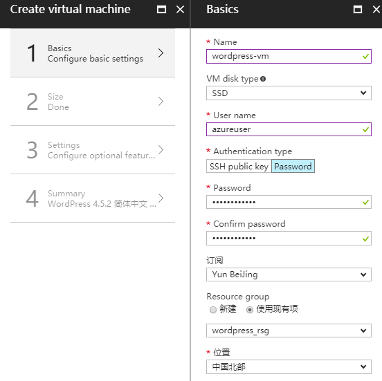

# Azure 市场虚拟机镜像和ARM模板部署指南

本文档包含如下四部分。

[TOC]

## 先决条件

1. 您需要一个有 Azure 账号，如果没有，可以 [申请试用账号](https://www.azure.cn/pricing/1rmb-trial?v=b)
2. 如果不使用试用账号，也可以 [申请预付费账号](https://www.azure.cn/pricing/pia/)

## 查找产品镜像
Azure 市场可以通过两种方式查找产品镜像，一种是通过[ Azure 市场](https://market.azure.cn)主页。另一种是通过[ Azure 门户](https://portal.azure.cn/)，Azure 门户如下图所示：

[ Azure 市场](https://market.azure.cn)主页包含`所有产品`、`服务商`等菜单，以及`热门推荐`、`热门产品类别`、`解决方案中心`等模块，几个主要模块如下。

### 所有产品
`所有产品`页面中提供了对 Azure 市场中所有产品和服务的浏览、过滤和查询等功能，包含了虚拟机镜像、ARM模板以及定制服务等产品，并按不同分类展示。 Azure 用户可以根据需要轻松查找到合适的产品与服务。  

### 服务商
`服务商`页面中链接到 Azure 市场服务商产品管理门户，用于服务商进行产品发布、更新、升级等的维护管理。 

### 解决方案中心
`解决方案中心`包含了数据管理、车联网、电子商务、数字营销、混合云、安全等七大类的基于 Azure 的优质解决方案，提供一站式的整体规划，内容包含用户场景与最佳实践、参考架构、解决方案等。Azure 用户可以根据情况，进行部署或直接联系服务商。

## 查看产品的详细信息	

当您单击产品分类中的一个产品图标或者标题时，将打开产品的详细信息页面。在这里，可以了解到该产品更为详细的使用说明。例如：

 

## 部署虚拟机镜像

单击镜像详细信息页面中顶部的`立即部署`按钮，登录到 Azure 门户，单击`创建`按钮，进入虚拟机创建的`基本配置页面`，出现四步骤如下图所示。下面主要对前三步的参数配置进行说明。

### 第一步配置：
- `Name`表示虚拟机名称，请输入1-64个字符。
- `VM disk type`表示虚拟机磁盘类型。
- `User name`表示创建的虚拟机登录用户名。
- `Authentication type`表示登录验证类型，可以是`SSH公钥`或者`Password验证`。
- `Password`和`Confirm password`表示当使用密码验证方式时使用的密码。注意，密码由小写字母、大写字母、数字、特殊符号中至少由3种组成，长度至少12位。
- `订阅`表示您要使用您帐户中的哪个订阅来创建资源。
- `Resource group`表示要资源要创建到哪个资源组内。
- `位置`表示资源要创建的位置。

### 第二步配置：

此步配置虚拟机的计算单元，及相应价格，相关 Azure 计算单元的描述，请参见 [Azure 计算单元 (ACU)](https://docs.azure.cn/zh-cn/virtual-machines/windows/acu)。

### 第三步配置：

- `High availability`表示是否将此虚拟机加入到`可用性集`中，添加的方法是：依次点击`Availability set`、`Create New`，并设置一个可用性集名称，如`wordpress-avset`单击`确定`。
- `Storage Disk type`表示使用的磁盘类型，有HDD和SSD可选择。
- `Use managed disks`表示是否使用托管磁盘，相关托管磁盘的描述，建议选择托管磁盘。请参见 [Azure 托管磁盘概述](https://docs.microsoft.com/zh-cn/azure/virtual-machines/windows/managed-disks-overview)
- `Virtual network`表示要使用的虚拟网络，相关虚拟网络描述，请参见 [Azure 虚拟网络](https://docs.azure.cn/zh-cn/virtual-network/virtual-networks-overview)。
- `Subnet`表示要使用的虚拟网络中的哪个子网（子网划分），相关子网的详情，请参见[添加、更改或删除虚拟网络子网](https://docs.azure.cn/zh-cn/virtual-network/virtual-network-manage-subnet)。
- `Public ip address`表示选择要创建的公共IP地址，相关公共IP地址详情，请参见[为 Azure 网络接口添加、更改或删除 IP 地址](https://docs.azure.cn/zh-cn/virtual-network/virtual-network-network-interface-addresses)。
- `Network security group`表示要添加的网络安全组，关于网络安全组详情，请参见[网络安全组（NSG）简介](https://www.azure.cn/blog/2017/08/04/NSCIntro)。
- `Extensions`表示要为此虚拟机添加的扩展插件，一般用于自动化部署等。
- `Monitoring`表示是虚拟机的诊断选项。

以上步骤配置完成后，第四步中检查核对参数概要无误后，点击底部`确定`按钮，即可开始部署。
 
如果您想了解更多使用门户创建虚拟机信息，也可以参看[使用 Azure 门户创建 Linux 虚拟机](https://docs.azure.cn/zh-cn/virtual-machines/linux/quick-create-portal)和[使用 Azure 门户创建 Windows 虚拟机](https://docs.azure.cn/zh-cn/virtual-machines/windows/quick-create-portal)章节。

## 部署ARM模板

部署ARM模板的步骤和部署虚拟机镜像类似，但由于ARM模板参数可以由开发者自定义，因此不同的ARM模板参数一般不同，如下图[服网LNMP集群](https://market.azure.cn/zh-cn/marketplace/apps/Servinet.lnmp_cluster_mysql_paas?tab=Overview)的配置参数，其参数的含义可以通过参数名称右方的提示符进行提示。

 

 
 
