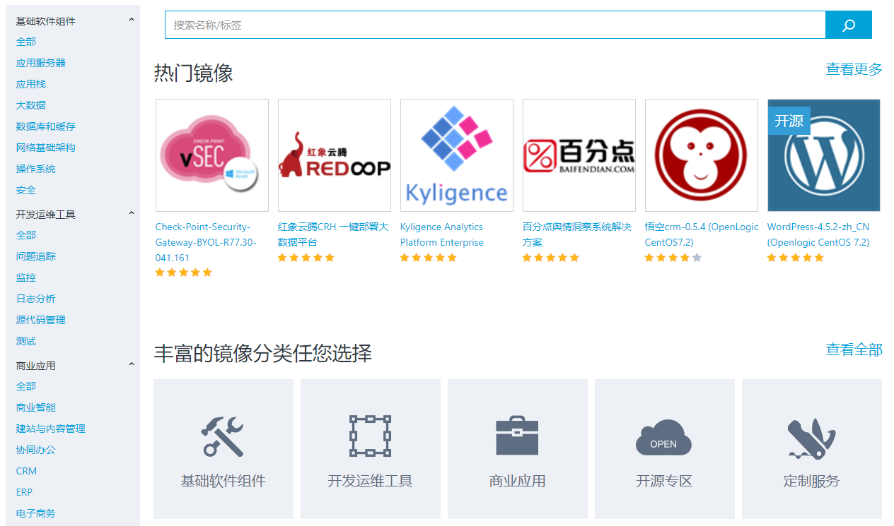

# 使用 Azure 镜像市场上发布的虚拟机镜像

## 先决条件

1. 您需要一个有 Azure 账户。（如果还没有，[请到这里购买](https://www.azure.cn/pricing/pia/)）
2. 如果您需要申请试用账号，[请访问这里](https://www.azure.cn/pricing/1rmb-trial?v=b)。

## 使用 Azure 镜像市场查找最佳虚拟机镜像

让我们一同浏览 Azure 镜像市场官方主页以展示如何查找最佳虚拟机镜像。在本页面，您将发现以下内容。

- Azure 镜像市场主页
- 像详细信息页面
- 下一步

### Azure 镜像市场主页

Azure 镜像市场主页位于 [~/](~/)。当您第一次访问此页面，您将看到如下图所示的界面。在此屏幕上，有三个主要部分，以下将依次介绍：

- 镜像列表和搜索功能
- 排序条
- 网站导航

### 了解镜像详细信息

当您单击镜像列表中的一个镜像或在列表中选择一个镜像并在动作条上单击[查看]操作时，将显示镜像详细信息页面。您将看到如下图所示的界面

页面大部分信息与您将在镜像列表概述中看到的一致，例如镜像的标题、图标和描述。然而，由于本页面有更多的空间所以描述可能比镜像列表中更完整。也有小部分的附加信息，如要在虚拟机上打开镜像的终结点和镜像可用的地区。
如果镜像收到社区用户的评价与评级，它们也将在页面底部显示。评价中往往包含了宝贵的意见，同时您也可以点击访问评价者的信息并取得联系。

### 部署虚拟机

从 Azure 镜像市场镜像部署虚拟机的方式有很多，但无论什么方法您都需要先申请一个 Azure 试用帐号 (除非您已经拥有一个账号)。一旦申请成功，我们可以进行下一步操作。

#### “轻松部署”虚拟机

